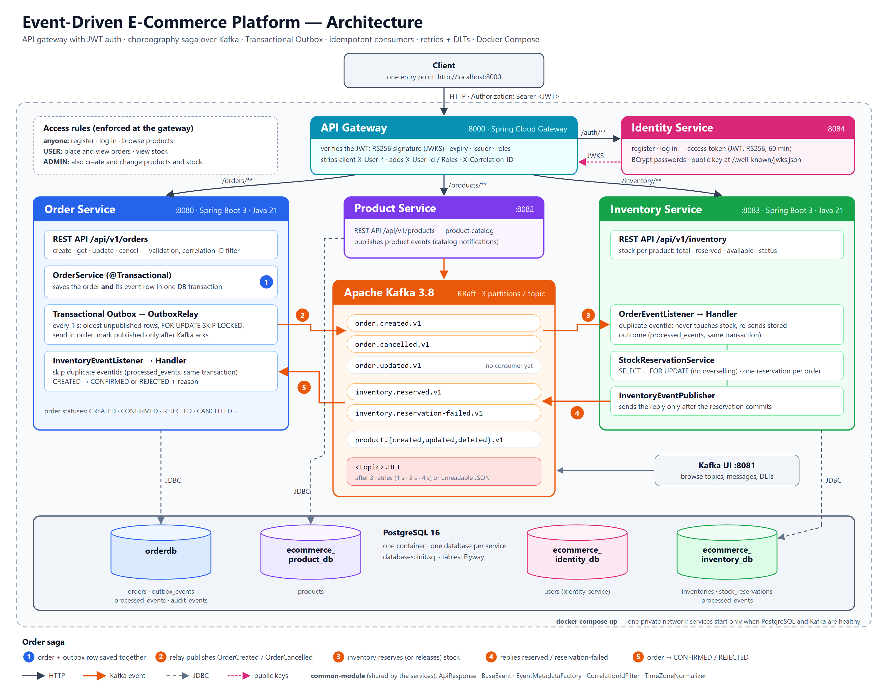

# 🛒 Event-Driven E-Commerce Platform

> An event-driven microservices backend built with **Java 21, Spring Boot 3, Spring Cloud Gateway, Spring Security, Apache Kafka, PostgreSQL and Docker**.

[](https://github.com/Arpitha-25/event-driven-ecommerce-system/actions/workflows/ci.yml)


---

# 📖 Overview

Clients reach the system through a single **API gateway**, which checks every request's **JWT access token** (issued by the identity service) and routes it to the right service. Each service has its own PostgreSQL database and REST API.

Order and Inventory services coordinate order fulfillment through a **choreography-based saga over Apache Kafka**: an order is confirmed only after inventory reserves its stock, and cancelling an order releases that stock. Order events are published through a **Transactional Outbox**, so an order and its event are always saved together, even while Kafka is down. Product Service publishes catalog events. A shared `common-module` provides the API response format, base event model, exceptions and utilities used by the services.



📄 Design, failure handling and test results:
- [docs/GATEWAY-AND-AUTH.md](docs/GATEWAY-AND-AUTH.md): the API gateway, the identity service and JWT authentication
- [docs/ORDER-INVENTORY-SAGA.md](docs/ORDER-INVENTORY-SAGA.md): the order → inventory saga
- [docs/TRANSACTIONAL-OUTBOX.md](docs/TRANSACTIONAL-OUTBOX.md): reliable event publishing from order-service
- [docs/RELIABLE-CONSUMERS.md](docs/RELIABLE-CONSUMERS.md): idempotent consumers, retries and dead-letter topics
- [docs/DOCKER-AND-SYSTEM-TESTS.md](docs/DOCKER-AND-SYSTEM-TESTS.md): running everything in Docker, and the full-flow system test
- [docs/DATABASE-MIGRATIONS.md](docs/DATABASE-MIGRATIONS.md): Flyway schema migrations
- [docs/CI.md](docs/CI.md): the GitHub Actions pipeline

---

# 🏗️ Architecture

```text
                                 Client
                                   │  Authorization: Bearer <JWT>
                                   ▼
                        API Gateway (:8000)  ◄── public keys (JWKS) ──  Identity Service (:8084)
                   verifies tokens · access rules ── /auth/** ──────►   register · login · JWT
                                   │                                     ecommerce_identity_db
         ┌─────────────────────────┼─────────────────────────┐
         ▼                         ▼                         ▼
   Order Service            Product Service           Inventory Service
      (:8080)                   (:8082)                    (:8083)
         │                         │                         │
         ▼                         ▼                         ▼
      orderdb             ecommerce_product_db      ecommerce_inventory_db
         │                         │                         │
         └─────────────────────────┼─────────────────────────┘
                                   ▼
                             Apache Kafka  ──►  Kafka UI (:8081)
```

## Order saga

```text
POST /orders ──► Order (CREATED) + outbox row          (one DB transaction)
                          │
                    OutboxRelay ──► order.created.v1 ──► Inventory: lock stock row
                                                              │
                     ┌──── inventory.reserved.v1 ◄────────────┤ enough stock → reserve
                     ▼                                        │
              Order CONFIRMED                                 │
                     ┌── inventory.reservation-failed.v1 ◄────┘ otherwise
                     ▼
              Order REJECTED (+ reason)

DELETE /orders/{id} ──► Order CANCELLED + outbox row
                                  │
                            OutboxRelay ──► order.cancelled.v1 ──► Inventory releases stock
```

---

# 🧩 Services

| Service | Responsibility | Kafka |
|---------|----------------|-------|
| API Gateway | Single entry point: routing, JWT verification, access rules, verified `X-User-*` headers, correlation IDs | — |
| Identity Service | Accounts (BCrypt), login, RS256-signed access tokens, public keys (JWKS) | — |
| Order Service | Create, read, update and cancel orders; confirms or rejects orders based on inventory's reply | Publishes order events; consumes inventory events |
| Product Service | Product catalog management | Publishes product events |
| Inventory Service | Stock levels per product; reserves stock for new orders and releases it for cancelled ones | Consumes order events; publishes inventory events |
| Common Module | Shared DTOs, base event, event metadata, exceptions, correlation ID filter, utilities | — |

---

# 🔌 REST API

All paths are served through the gateway at `http://localhost:8000`.

| Path | Endpoints | Who |
|------|-----------|-----|
| `/api/v1/auth` | `POST /register`, `POST /login` | anyone |
| `/api/v1/auth` | `GET /me` | logged in |
| `/api/v1/products` | `GET /`, `GET /{id}` | anyone |
| `/api/v1/products` | `POST /`, `PUT /{id}`, `DELETE /{id}` | ADMIN |
| `/api/v1/inventory` | `GET /`, `GET /{id}`, `GET /product/{productId}` | logged in |
| `/api/v1/inventory` | `POST /`, `PUT /{id}`, `DELETE /{id}` | ADMIN |
| `/api/v1/orders` | `POST /`, `GET /{id}`, `PUT /{id}`, `DELETE /{id}` | logged in |

Log in with `POST /api/v1/auth/login`, then send `Authorization: Bearer <accessToken>`. A missing or invalid token gets 401 and a missing role gets 403, both as JSON. Each service also serves Swagger UI at `/swagger-ui.html` and Actuator at `/actuator/health`.

---

# 🔄 Kafka Events

| Service | Event | Topic |
|---------|-------|-------|
| Order | `OrderCreatedEvent` | `order.created.v1` |
| Order | `OrderUpdatedEvent` | `order.updated.v1` |
| Order | `OrderCancelledEvent` | `order.cancelled.v1` |
| Product | `ProductCreatedEvent` | `product.created.v1` |
| Product | `ProductUpdatedEvent` | `product.updated.v1` |
| Product | `ProductDeletedEvent` | `product.deleted.v1` |
| Inventory | `InventoryReservedEvent` | `inventory.reserved.v1` |
| Inventory | `InventoryReservationFailedEvent` | `inventory.reservation-failed.v1` |

Order events are written to the `outbox_events` table in the same transaction as the order, then published by `OutboxRelay`, usually within about a second.
Every consumer records the event IDs it has handled (`processed_events`), so a redelivered event is skipped. Events that still fail after 3 retries (1 s, 2 s, 4 s backoff), or that can't be read at all, are moved to `<topic>.DLT`.

---

# ⭐ Features

- API gateway (Spring Cloud Gateway) as the single entry point, with routing and timeouts
- JWT authentication: RS256 tokens from a dedicated identity service, verified at the gateway against published public keys (JWKS); role-based access rules (USER / ADMIN)
- The gateway strips client-supplied `X-User-*` headers and adds verified `X-User-Id` / `X-User-Roles`, so identity can't be spoofed
- BCrypt password hashing; login doesn't reveal which emails are registered
- Choreography-based saga between Order and Inventory services
- Transactional Outbox: order events saved atomically with the order and published by a scheduled relay (`FOR UPDATE SKIP LOCKED`, ordered, retried, at-least-once)
- Idempotent consumers: every listener records processed event IDs in the same transaction as its work (`INSERT … ON CONFLICT DO NOTHING`), backed by reservations keyed by order ID and order-status guards
- Pessimistic row locking (`SELECT … FOR UPDATE`) so concurrent orders can't oversell stock
- Handles a cancellation that arrives before its creation event
- Retries with exponential backoff (1 s, 2 s, 4 s) and dead-letter topics carrying the failure reason in headers (`DefaultErrorHandler` + `DeadLetterPublishingRecoverer`)
- Consumers own their event classes; no shared Java types or type headers between services
- Correlation ID carried from the client's request, through the gateway, into every saga event
- Database schemas versioned with Flyway; Hibernate only validates (`ddl-auto: validate`), so a mismatch stops startup
- Global exception handling with a standard `ApiResponse` / `ApiError` format; DTOs with Bean Validation and MapStruct
- OpenAPI / Swagger documentation; Spring Boot Actuator health, info and metrics
- Every service in Docker: multi-stage images (Maven build, then a non-root JRE runtime), one `docker compose up` for the whole system
- CI on GitHub Actions: build, unit and integration tests, then the Docker system test, on every push and pull request
- Tests at every level: unit (JUnit 5, Mockito); integration on real PostgreSQL and Kafka (Testcontainers), including concurrent duplicates, racing orders, a lost reply and forged or expired tokens; full-system tests running the real images; end-to-end scripts, including a Kafka outage test

---

# 🛠️ Technology Stack

| Area | Tools |
|------|-------|
| Language & framework | Java 21, Spring Boot 3.3 (Web, WebFlux, Data JPA, Validation, Actuator) |
| Gateway & security | Spring Cloud Gateway, Spring Security (OAuth2 resource server), Nimbus JOSE + JWT, BCrypt |
| Messaging | Apache Kafka 3.8, Spring Kafka, Kafka UI |
| Database | PostgreSQL 16, Flyway migrations |
| Mapping & boilerplate | MapStruct, Lombok |
| API docs | springdoc-openapi (Swagger UI) |
| Testing | JUnit 5, Mockito, Spring Boot Test, Testcontainers (PostgreSQL, Kafka), MockWebServer |
| Build & run | Maven, Docker (multi-stage images), Docker Compose, GitHub Actions |

---

# 📂 Project Structure

```text
event-driven-ecommerce-system
├── api-gateway           # Spring Cloud Gateway: routing + JWT verification
├── identity-service      # accounts, login, JWT issuing, JWKS
├── common-module         # constant, dto, event, exception, filter, util
├── order-service         # each service has its own Dockerfile
├── product-service
├── inventory-service
├── system-tests          # full-flow tests in Docker (Maven profile: -Psystem-tests)
├── docker
│   └── postgres
│       └── init.sql      # creates any missing service database (tables come from Flyway)
├── docs                  # design, test results and how-tos for each feature
├── scripts               # end-to-end tests: gateway + auth, saga, reliable consumers, Kafka outage
├── .github/workflows     # CI
├── docker-compose.yml    # the whole system
└── pom.xml               # parent POM
```

---

# 💻 Running Locally

## Option A: everything in Docker (only Docker needed)

```bash
git clone https://github.com/Arpitha-25/event-driven-ecommerce-system.git
cd event-driven-ecommerce-system

docker compose up -d --build     # first build takes a few minutes
docker compose ps                # everything Up; db-init Exited (0) after creating the databases
docker compose down              # stop (add -v to also delete the database volume)
```

Then use the gateway at http://localhost:8000. For example, in PowerShell:

```powershell
Invoke-RestMethod -Method Post http://localhost:8000/api/v1/auth/register -ContentType application/json -Body '{"email":"me@example.com","password":"my-password-1"}'
$token = (Invoke-RestMethod -Method Post http://localhost:8000/api/v1/auth/login -ContentType application/json -Body '{"email":"me@example.com","password":"my-password-1"}').data.accessToken
Invoke-RestMethod http://localhost:8000/api/v1/auth/me -Headers @{ Authorization = "Bearer $token" }
```

A development admin account is created from `docker-compose.yml` (`admin@ecommerce.local` / `admin12345`). Change it for anything other than local development.

## Option B: infrastructure in Docker, services from your IDE or `java -jar`

**Prerequisites:** Java 21, Maven and Docker.

```bash
docker compose up -d postgres db-init kafka kafka-ui   # infrastructure only
mvn clean install                                      # unit and integration tests (Testcontainers needs Docker)

java -jar identity-service/target/identity-service-0.0.1-SNAPSHOT.jar    # :8084
java -jar api-gateway/target/api-gateway-0.0.1-SNAPSHOT.jar              # :8000
java -jar order-service/target/order-service-0.0.1-SNAPSHOT.jar          # :8080
java -jar product-service/target/product-service-0.0.1-SNAPSHOT.jar      # :8082
java -jar inventory-service/target/inventory-service-0.0.1-SNAPSHOT.jar  # :8083
```

If the containers from Option A are running, stop the application containers first, because they use the same ports. Set `IDENTITY_ADMIN_EMAIL` and `IDENTITY_ADMIN_PASSWORD` before starting identity-service to get an admin account.

| URL | Purpose |
|-----|---------|
| http://localhost:8000 | API gateway: the entry point for clients |
| http://localhost:8084/swagger-ui.html | Identity Service API |
| http://localhost:8080/swagger-ui.html | Order Service API |
| http://localhost:8082/swagger-ui.html | Product Service API |
| http://localhost:8083/swagger-ui.html | Inventory Service API |
| http://localhost:8081 | Kafka UI |

## Tests

```bash
mvn clean install                               # unit + integration tests (real PostgreSQL/Kafka via Testcontainers)
mvn install -Psystem-tests                      # also the full-system tests: builds the images and runs them in Docker
```

GitHub Actions runs both on every push to `main` and on every pull request (see [docs/CI.md](docs/CI.md)).

End-to-end scripts, run against a running system:

```powershell
powershell -ExecutionPolicy Bypass -File scripts\test-gateway-auth.ps1        # needs Option A (the gateway and identity)
powershell -ExecutionPolicy Bypass -File scripts\test-order-saga.ps1
powershell -ExecutionPolicy Bypass -File scripts\test-reliable-consumers.ps1
powershell -ExecutionPolicy Bypass -File scripts\test-outbox-kafka-outage.ps1   # stops Kafka for about a minute
```

Services connect to `localhost` with `postgres` / `postgres` credentials by default. Override them with
`SPRING_DATASOURCE_URL`, `SPRING_DATASOURCE_USERNAME`, `SPRING_DATASOURCE_PASSWORD`
and `SPRING_KAFKA_BOOTSTRAP_SERVERS`.

---

# 👨‍💻 Author

**Arpitha R**

- GitHub: https://github.com/Arpitha-25
